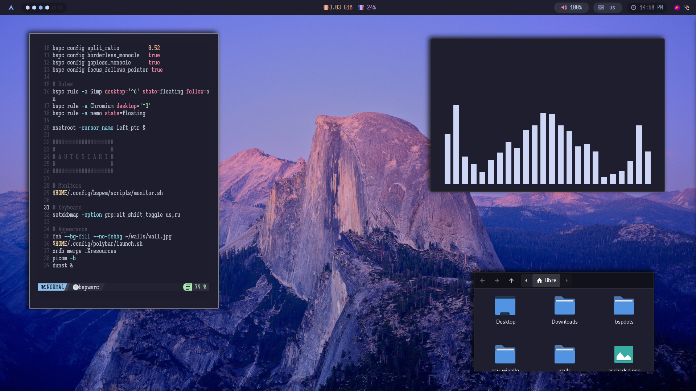

<h1 align="center">Welcome to my Dotfiles.</h1>

## Installation
```
git clone https://github.com/librequit/bspdots.git
cd bspdots && chmod +x setup.sh
./setup.sh
```


category        | value
---             | ---
Distro          | [Arch Linux](https://archlinux.org/)
Wallpaper       | [here](../misc/walls)
Colorscheme     | [Catppuccin](https://github.com/catppuccin/catppuccin)
Fonts           | [IosevkaTermSlab](https://github.com/ryanoasis/nerd-fonts/releases/download/v3.1.1/IosevkaTermSlab.zip), [Iosevka Mayukai](https://github.com/Iosevka-Mayukai/Iosevka-Mayukai)
WM              | [bspwm](https://github.com/baskerville/bspwm)
Terminal        | [kitty](https://github.com/kovidgoyal/kitty)
Shell           | [bash](https://github.com/gitGNU/gnu_bash)
Editor          | [Neovim](https://neovim.io)
File Manager    | [lf](https://github.com/gokcehan/lf)
Music Player    | [ncmpcpp](https://github.com/munguua/ncmpcpp-ueberzug)
Launcher        | [Rofi](https://github.com/davatorium/rofi)
Web Browser     | [Ungoogled Chromium](https://github.com/ungoogled-software/ungoogled-chromium)
Image Viewer    | [nsxiv](https://github.com/nsxiv/nsxiv)
Media Player    | [mpv](https://mpv.io/)
Notifications   | [dunst](https://dunst-project.org/)


# Credits and more..  
- I am using [IosevkaTermSlab font](https://github.com/ryanoasis/nerd-fonts/releases/download/v3.1.1/IosevkaTermSlab.zip) and a custom font called [Iosevka Mayukai](https://github.com/Iosevka-Mayukai/Iosevka-Mayukai).
- [Catppuccin](https://github.com/catppuccin/catppuccin) colorscheme which I've used in my rice.
- [Rofi Catppuccin](https://github.com/catppuccin/rofi) rofi which I've used in my rice.
